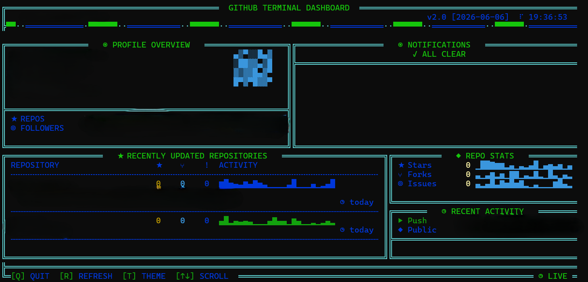

# GitHub Terminal Dashboard

A rich, animated terminal dashboard for GitHub - built with **pure Python** and zero third-party dependencies.

<div align="center">
  


</div>

---

## Features

- **Animated loading screen** with matrix rain, ASCII logo, and live progress bar
- **Live header** with sine wave animation, spinner, clock, and username
- **Profile panel** with procedural avatar, bio, location, member age, and stat bars
- **Notifications panel** with type icons, reason color-coding, and unread badge
- **Repositories panel** with sparklines, language colors, star/fork/issue counts, and scroll support
- **Stats panel** with language breakdown, ratio bars, and total repo metrics
- **Activity feed** with event type bar chart and relative timestamps
- **4 built-in themes** - Cyberpunk, Matrix, Amber, Ice - switchable live
- **Auto-refresh** every 5 minutes in the background
- **Double-line box borders** with inner separators throughout
- **Zero dependencies** - only Python standard library (`curses`, `urllib`, `json`, `threading`)

---

## Requirements

- Python 3.6 or newer
- A GitHub Personal Access Token (Classic)
- **Windows only:** `pip install windows-curses`

---

## Installation

### Windows (Command Prompt or PowerShell)

```powershell
curl -o "Github DashBoard.py" "https://raw.githubusercontent.com/Vendetaaaa/Githipedia/main/PROGRAM/Github%20DashBoard.py"
pip install windows-curses
python "Github DashBoard.py"
```

---

## First Run - Setup Wizard

On first launch the setup wizard runs automatically:

```
  ╔══════════════════════════════════════╗
  ║     GITHUB DASHBOARD SETUP WIZARD    ║
  ╚══════════════════════════════════════╝

  GitHub Username : your_username
  Personal Access Token (Classic) : ghp_xxxxxxxxxxxx

  ✓ Config saved to ~/.github_widget_config.json
```

Credentials are saved to `~/.github_widget_config.json` with `chmod 600` permissions so only your user account can read the file. Every subsequent run skips the wizard and goes straight to the dashboard.

---

## Getting a Personal Access Token

1. Go to **github.com → Settings → Developer settings → Personal access tokens → Tokens (classic)**
2. Click **Generate new token (classic)**
3. Give it a name and set an expiry date
4. Select these scopes:

| Scope | Purpose |
|---|---|
| `repo` | Read repository data |
| `notifications` | Read unread notifications |
| `read:user` | Read profile information |

5. Click **Generate token** and copy it - you only see it once

---

## Keybinds

| Key | Action |
|---|---|
| `T` | Cycle theme (Cyberpunk → Matrix → Amber → Ice) |
| `↓` or `J` | Scroll repositories down |
| `↑` or `K` | Scroll repositories up |
| `R` | Force refresh all data from GitHub API |
| `Q` or `Esc` | Quit |

---

## Themes

| Theme | Colors | Aesthetic |
|---|---|---|
| **Cyberpunk** | Cyan + Green + Yellow | Default neon hacker look |
| **Matrix** | Green on black | Classic terminal green |
| **Amber** | Yellow + Red | Retro phosphor monitor |
| **Ice** | White + Blue + Cyan | Clean cold palette |

Press `T` at any time to cycle through themes without restarting.

---

## Auto-Refresh

Data refreshes automatically every **5 minutes** in a background thread - the dashboard stays animated and interactive the whole time. Press `R` to trigger an immediate refresh at any point.

---

## Auto-Start on Boot

### Windows - Task Scheduler (recommended)

1. Press `Win + R`, type `taskschd.msc`, hit Enter
2. Click **Create Basic Task**
3. Set trigger to **When I log on**
4. Set action to **Start a program**:
   - Program: `cmd`
   - Arguments: `/k "python "C:\Users\User\Github DashBoard.py""`

---

## Reset Credentials

Delete the config file and re-run to go through the setup wizard again:

```bash

# Windows (Command Prompt)
del %USERPROFILE%\.github_widget_config.json
```

---

## Troubleshooting

**`SyntaxError: illegal target for annotation` on Windows**
The file downloaded as a 404 error page. Your repo is private - make it public or re-download after making it public, deleting the broken file first:
```powershell
del "Github DashBoard.py"
```

**`ModuleNotFoundError: No module named '_curses'` on Windows**
```powershell
pip install windows-curses
```

**Terminal too small warning**
Resize your terminal to at least 80 columns × 24 rows and press any key.

**`401 Bad credentials` in dashboard panels**
Your token has expired or missing scopes. Generate a new one at github.com → Settings → Developer settings → Personal access tokens, delete the config file, and re-run.

**Arrow keys not working**
Use `J` (down) and `K` (up) as alternatives. On some Windows terminals, arrow keys need `windows-curses` installed to work correctly.

---

## License

MIT

## Terms of Service & Data Usage

1. Acceptance of Terms
By executing this Python script, you acknowledge that you are using this software at your own risk. This dashboard is provided "as is" without any warranty of any kind, express or implied.

2. Data Collection Policy
Local Storage Only: Your GitHub Personal Access Token and Username are stored purely locally on your machine inside the configuration file (~/.github_widget_config.json).

Zero Third-Party Transmission: This script communicates exclusively with the official secure GitHub API (https://api.github.com). No telemetry, analytics, or user data are tracked, stored, or transmitted to any external servers or third parties.

No Caching: Data pulled from the GitHub API is processed entirely in volatile system memory (RAM) to render the dashboard interface and is discarded when the application closes or refreshes.

3. Security Responsibilities
You are solely responsible for safeguarding your GitHub Personal Access Token.

Do not share your local config file. It is recommended to keep standard OS user account restrictions active to prevent unauthorized local reading of the storage file.
