<div align="center">


 


 
</div>

## About this guide
 
A clean reference for every GitHub achievement and badge. Each one is explained properly, with actual step-by-step instructions for earning it, not just a vague description of what it is.
 
---
 
## Table of Contents
 
- [What Are GitHub Achievements?](#what-are-github-achievements)
- [Things You Should Know First](#things-you-should-know-first)
  - [Repositories](#-what-is-a-repository)
  - [Pull Requests](#-what-is-a-pull-request)
  - [Branches](#-what-is-a-branch)
  - [What "Merged" Actually Means](#-what-does-merged-mean)
- [The Achievements](#the-achievements)
  - [Quick Table](#quick-overview-table)
  - [🔫 Quick Draw](#-quick-draw)
  - [🦈 Pull Shark](#-pull-shark)
  - [🧠 Galaxy Brain](#-galaxy-brain)
  - [🦉 YOLO](#-yolo)
  - [👥 Pair Extraordinaire](#-pair-extraordinaire)
  - [⭐ Starstruck](#-starstruck)
  - [❤️ Heart on Your Sleeve](#️-heart-on-your-sleeve)
  - [🧙 Open Sourcerer](#-open-sourcerer)
  - [💝 GitHub Sponsor](#-github-sponsor)
  - [🧊 Arctic Code Vault Contributor](#-arctic-code-vault-contributor)
  - [🚀 Mars 2020 Contributor](#-mars-2020-contributor)
- [Showing Your Badges](#showing-your-badges)
- [Resources](#resources--further-reading)
- [License](#license)
---
 
## What Are GitHub Achievements?
 
<div align="center">

[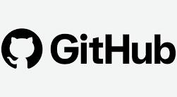](./Badges/GL.jpg)
 
</div>

GitHub achievements are profile badges you earn by hitting certain milestones. They show up on your public profile automatically. No setup, no claiming, they just appear. Think of them as quiet little trophies that tell anyone visiting your profile something about the kind of contributor you are.
 
There are currently **9 badges you can still earn** and **2 legacy ones** that were given out in 2020 and are gone forever. This guide covers all of them. Step-by-step instructions for the ones you can get, and the actual stories behind the ones you can't.
 
Almost everything here is free. The only exception is the Sponsor badge, which requires spending money, and that one's kind of beside the point anyway.
 
> 💬 Badges live in a dedicated section on your profile, visible to everyone who visits.
 
---
 
## Things You Should Know First
 
Most achievements revolve around the same few concepts. If you're already comfortable with Git and GitHub day-to-day, skip this section. If you're newer to it, read it. Everything below will make a lot more sense.
 
### 🗂 What is a Repository?
 
A repository (almost always just called a "repo") is a project folder that lives on GitHub. It stores your files and the full history of every change ever made to them, so you can go back if something breaks.
 
You can create your own repos from scratch, or **fork** someone else's, which just means making your own personal copy of their project that you can mess around with freely.
 
```
my-project/          ← this whole folder is the repository
├── index.html
├── style.css
└── README.md
```
 
### 🔀 What is a Pull Request?
 
This is the concept behind most of the achievements, so it's worth really understanding.
 
Imagine you find a bug in an open-source project you use. You can't just edit someone else's files directly. Instead, GitHub has a structured process for this called a **Pull Request** (PR). It's literally a request for someone to *pull* your changes into their project.
 
```
Step 1: Fork the repo       → you get your own copy to work in safely
Step 2: Make your changes   → fix the bug in YOUR copy
Step 3: Open a Pull Request → "hey, I fixed something, want to include it?"
Step 4: Maintainer reviews  → they check your work
Step 5: They merge it       → your fix is now part of the original project 🎉
```
 
### 🌿 What is a Branch?
 
A branch is a parallel version of your repo. Instead of editing the main code directly (risky, one mistake can break everything), you create a branch, do your work there, and merge it back when it's ready.
 
```bash
git checkout -b my-new-feature    # create and switch to a new branch
# make your changes...
git add .
git commit -m "describe what changed and why"
git push origin my-new-feature    # push to GitHub, then open a PR from there
```
 
### ✅ What does "Merged" mean?
 
When a PR is **merged**, the changes were accepted and permanently combined into the main codebase. That's the finish line.
 
> ⚠️ A PR that's open, or closed without merging, doesn't count toward any achievements. It has to actually be merged.
 
---
 
## The Achievements
 
### Quick Overview Table
 
<div align="center">
  
| Badge | Difficulty | Type | Earnable? |
|---|---|---|---|
| 🔫 Quick Draw | ⭐⭐ Medium | Pull Request | ✅ |
| 🦈 Pull Shark | ⭐ Easy | Pull Request | ✅ |
| 🧠 Galaxy Brain | ⭐⭐⭐ Hard | Pull Request | ✅ |
| 🦉 YOLO | ⭐ Easy* | Pull Request | ✅ |
| 👥 Pair Extraordinaire | ⭐⭐ Medium | Collaboration | ✅ |
| ⭐ Starstruck | ⭐⭐⭐ Hard | Community | ✅ |
| 💝 GitHub Sponsor | 💳 Paid | Financial | ✅ |
| ❤️ Heart on Your Sleeve | ❓ Unknown | Unknown | ❓ |
| 🧙 Open Sourcerer | ❓ Unknown | Unknown | ❓ |
| 🧊 Arctic Code Vault | 🕰️ Legacy | Historical | ❌ |
| 🚀 Mars 2020 | 🕰️ Legacy | Historical | ❌ |
 
</div>

*\*Easy only on a repo you own*
 
---
 
### 🔫 Quick Draw
 
<div align="center">

[](./Badges/QD.T1.png)
 
</div>

**Merge a pull request within 5 minutes of opening it on a repo you own.**
 
The 5-minute window starts the second you open the PR. Since you own the repo, you're also the one who can approve the merge, so nothing is actually stopping you except the clock.
 
#### How to do it
 
**1.** Create a repo (or use one you already own).
 
**2.** Clone it, make a branch, push a small change:
 
```bash
git clone https://github.com/YOUR-USERNAME/YOUR-REPO.git
cd YOUR-REPO
git checkout -b quick-fix
echo "quick change" >> notes.txt
git add .
git commit -m "quick fix"
git push origin quick-fix
```
 
**3.** GitHub will show a banner prompting you to open a PR. Click it immediately.
 
**4.** Merge it. Don't go make coffee first.
 
> ⚡ Pre-write your PR title before pushing so you're not fumbling with it after. The clock starts when you open the PR, not when you push.
 
---
 
### 🦈 Pull Shark
 
| Tier | x1 | x2 | x3 | x4 |
|---|---|---|---|---|
| **Badge** | [](./Badges/PullShark/PS-T1.png) | [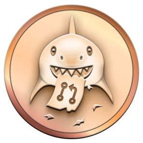](./Badges/PullShark/PS-T2.png) | [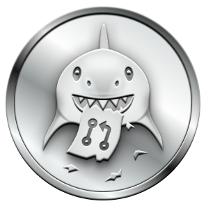](./Badges/PullShark/PS-T3.png) | [](./Badges/PullShark/PS-T4.png) |
| **PRs Needed** | 2 | 16 | 128 | 1024 |
 
**Get pull requests merged into repositories that other people own.**
 
This is the core open-source contribution badge. Someone else reviews your work and decides it's good enough to include. That's the whole thing.
 
#### Finding your first PR
 
The best place to start is repos tagged with `good first issue`. Maintainers add that label specifically to flag things that are approachable for newcomers.
 
```
is:open label:"good first issue" language:javascript
is:open label:"help wanted" type:issue
```
 
Or use [goodfirstissue.dev](https://goodfirstissue.dev). It's a curated feed of these, updated daily.
 
Once you find something:
 
1. Read the issue properly before touching anything
2. Fork the repo, create a branch, make your fix
3. Write a clear PR title and description. Maintainers are busy and they appreciate the context.

```
✅  "Fix broken link in installation docs (fixes #42)"
❌  "fix stuff"
```
 
4. Reply to review comments. The maintainer gave up time to look at your work.
> 💡 The easiest wins for beginners are usually documentation fixes, typo corrections, and broken links. They get merged fast because the risk to the codebase is basically zero.
 
---
 
### 🧠 Galaxy Brain
 
| Tier | x1 | x2 | x3 | x4 |
|---|---|---|---|---|
| **Badge** | [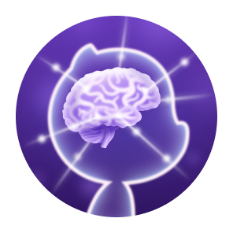](./Badges/GalaxyBrain/GB-T1.png) | [](./Badges/GalaxyBrain/GB-T2.png) | [](./Badges/GalaxyBrain/GB-T3.png) | [](./Badges/GalaxyBrain/GB-T4.png) |
| **Approvals Needed** | 2 | 8 | 16 | 32 |
 
**Have a pull request merged that received 2 or more approving reviews.**
 
This one is about quality. Two separate people read your code, thought it through, and clicked Approve. Then a maintainer merged it. It means your contribution was substantial enough that multiple reviewers engaged with it seriously.
 
```
You open a PR
      ↓
Reviewer A reads your code → Approve ✅
      ↓
Reviewer B reads your code → Approve ✅
      ↓
Maintainer merges → 🧠 Galaxy Brain unlocked
```
 
#### How to earn it
 
Target **larger, well-maintained projects**. They often have branch protection rules that *require* 2+ approvals before anything can merge, so you'll earn it naturally if your PR gets accepted.
 
Good places to start: [freeCodeCamp](https://github.com/freeCodeCamp/freeCodeCamp), [EddieHubCommunity](https://github.com/EddieHubCommunity), [The Odin Project](https://github.com/TheOdinProject/curriculum).
 
Make **meaningful contributions**. A one-character typo fix rarely attracts two reviewers. A well-thought-out refactor, a new feature, or thorough documentation will.
 
> 🎯 Contribute to a project you actually use. You'll understand the codebase better, write more relevant PRs, and the reviewers will notice.
 
---
 
### 🦉 YOLO
 
<div align="center">
  
[](./Badges/YOLO-T1.png)
 
</div>

**Merge a pull request without requesting any reviews, going straight from open to merged.**
 
In practice you'll do this on your own repo. No reviewers, no approvals, no waiting. Open the PR, merge it immediately.
 
```bash
# Same as Quick Draw, just don't add any reviewers
# PR opened → (no reviewers added) → Merge → 🦉 YOLO
```
 
> ⚠️ The badge is called YOLO because in real-world development, merging without a review is genuinely considered bad practice. It's one of the most reliable ways to introduce bugs into production. Fine for your sandbox repo. Please don't bring this habit to team projects.
 
---
 
### 👥 Pair Extraordinaire
 
| Tier | x1 | x2 | x3 | x4 |
|---|---|---|---|---|
| **Badge** | [](./Badges/PairExtra/PE-T1.png) | [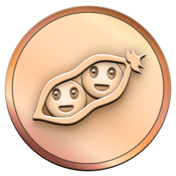](./Badges/PairExtra/PE-T2.png) | [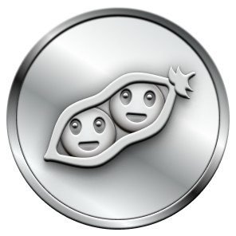](./Badges/PairExtra/PE-T3.png) | [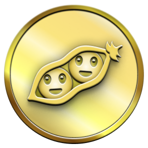](./Badges/PairExtra/PE-T4.png) |
| **Co-authored PRs** | 1 | 10 | 24 | 48 |
 
**Be credited as a co-author on a commit that gets included in a merged PR.**
 
Git lets you share authorship credit for a commit. When that commit lands in a merged PR, everyone listed, author and all co-authors, gets this badge.
 
#### How to add a co-author
 
Add the co-author line at the very end of your commit message, after a blank line:
 
```bash
git commit -m "Add responsive navbar
 
Co-authored-by: Jane Doe <janedoe@users.noreply.github.com>"
```
 
The email has to exactly match the co-author's GitHub-linked email. Most people also have a private no-reply address in this format: `USERNAME@users.noreply.github.com`. Your collaborator can find theirs under Settings → Emails.
 
```
Person A writes the code
Person B adds the Co-authored-by line to the commit
Both push → PR opens → PR merges → Both earn the badge ✅
```
 
> 💡 Finding a partner: jump into an open-source Discord and ask if anyone wants to co-author a small contribution. Most people say yes because they get the badge too.
 
---
 
### ⭐ Starstruck
 
| Tier | x1 | x2 | x3 | x4 |
|---|---|---|---|---|
| **Badge** | [](./Badges/Starstruck/SS-T1.png) | [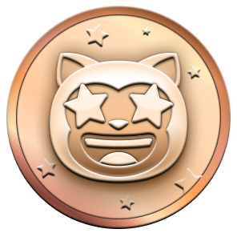](./Badges/Starstruck/SS-T2.png) | [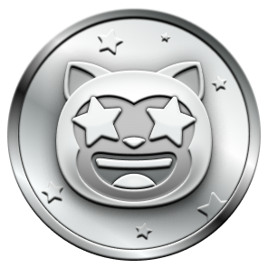](./Badges/Starstruck/SS.T3.png) | [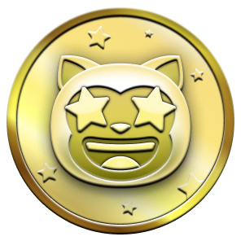](./Badges/Starstruck/SS-T4.png) |
| **Stars Needed** | 16 | 128 | 512 | 4096 |
 
**Have a repo you created receive 16 or more stars.**
 
Stars are GitHub's bookmarking system. When someone stars your repo it means they found it useful or interesting enough to save. Getting 16 genuine stars means real people got something out of what you built.
 
#### What tends to attract stars
 
| What You Build | Examples |
|---|---|
| 🛠️ Developer tools | CLI scripts, VS Code extensions, browser add-ons |
| 📚 Study notes | Course summaries, language cheatsheets, algorithm guides |
| 🎨 Templates | GitHub profile READMEs, resume templates, starter kits |
| 🤖 Automation | GitHub Actions, scheduled scripts, bots |
| 📋 Curated lists | "Awesome X" collections on any niche topic |
| 🎮 Fun projects | Games, visualizations, creative experiments |
 
#### Getting your repo discovered
 
- Write a good README. Clear title, what it does, how to install it, maybe a screenshot. People star repos they understand at a glance.
- Share it where it's genuinely relevant. Not everywhere, just in communities where your project actually helps people.
- Add topics to your repo. It makes it show up in GitHub search.
- If it's a developer tool, a Show HN post on Hacker News can send a serious wave of early stars.

> 🌟 Don't ask people to star it. Build something useful, put it in front of the right people, and the stars come on their own.
 
---
 
### ❤️ Heart on Your Sleeve
 
| Tier | x1 | x2 | x3 | x4 |
|---|---|---|---|---|
| **Badge** | [](./Badges/HeartsS/HS-T1.png) | [](./Badges/HeartsS/HS-T2.png) | [](./Badges/HeartsS/HS-T3.png) | [](./Badges/HeartsS/HS-T4.png) |
| **Required** | ❓ | ❓ | ❓ | ❓ |
 
The exact requirements for this badge haven't been publicly documented. If you've earned it and know what triggered it, [open an issue](https://github.com/Vendetaaaa/Githipedia/issues/new). It would genuinely help a lot of people.
 
---
 
### 🧙 Open Sourcerer
 
| Tier | x1 | x2 | x3 | x4 |
|---|---|---|---|---|
| **Badge** | [](./Badges/OpenS/OS-T1.png) | [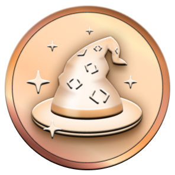](./Badges/OpenS/OS-T2.png) | [](./Badges/OpenS/OS-T3.png) | [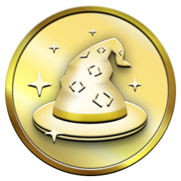](./Badges/OpenS/OS-T4.png) |
| **Required** | ❓ | ❓ | ❓ | ❓ |
 
Same situation. The exact trigger hasn't been confirmed. The community theory is that it's related to having PRs merged across multiple different repos in a short window, but nothing is verified. Watch this space.
 
---
 
### 💝 GitHub Sponsor
 
<div align="center">
  
[](./Badges/PS-T1.png)
 
</div>

**Financially sponsor an open-source developer or project through GitHub Sponsors.**
 
Open-source runs on the volunteered time of real people. Sponsoring someone, even at $1/month, is a meaningful way to give back to the tools you actually rely on.
 
**How to do it:**
 
1. Go to [github.com/sponsors](https://github.com/sponsors)
2. Search for a developer or project you use
3. Pick a tier (most start at $1/month)
4. Add payment and confirm. The badge appears immediately.

> 💙 Where to start: think about which libraries show up in all your projects. Check if their maintainers have Sponsors pages. The person maintaining a package with 10 million weekly downloads often makes nothing from it.
 
---
 
### 🧊 Arctic Code Vault Contributor
 
<div align="center">

[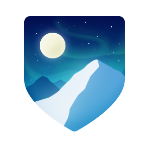](./Badges/2020AC-T1.png)
 
</div>

**A permanent badge for contributors whose code was physically archived in the GitHub Arctic Code Vault.**
 
In February 2020, GitHub photographed every active public repository onto archival film reels, the same technology used to preserve documents for centuries. Those reels were transported to a decommissioned coal mine deep inside a mountain in **Svalbard, Norway**, one of the most geologically stable places on the planet.
 
The goal was to preserve the world's open-source code for over 1,000 years.
 
```
Your code on GitHub → photographed onto film → 🏔️ Svalbard, Norway → ❄️ permafrost vault
```
 
If you contributed to any public repo before **February 2, 2020**, your code is in that vault right now. This badge can no longer be earned. If it's on your profile, something you wrote is buried under Arctic permafrost, preserved for a thousand years.
 
---
 
### 🚀 Mars 2020 Contributor
 
<div align="center">
  
[](./Badges/2020MC-T1.png)
 
</div>

**Awarded to contributors whose open-source code ended up running on NASA's Perseverance Mars rover.**
 
Perseverance landed on Mars on **February 18, 2021**. The software powering it, and the Ingenuity helicopter it carried, depended on open-source libraries hosted on GitHub. Contributors to those libraries got this badge.
 
```
You contributed to open source
        ↓
NASA used that library in the rover's software
        ↓
🚀 your code physically landed on another planet
```
 
The contribution window closed July 28, 2020. This badge is gone. But if you have it, your code is literally on Mars right now.
 
---
 
## Showing Your Badges
 
Achievements appear automatically on your profile the moment you earn them. But you can also drop them into any README:
 
```markdown


```
 
Or with size control:
 
```html


```
 
---
 
## Resources & Further Reading
 
<div align="center">
  
| Resource | What It Gets You |
|---|---|
| [GitHub Docs - Profile & Achievements](https://docs.github.com/en/account-and-profile) | The official word on everything profile-related |
| [Schweinepriester's Achievement Tracker](https://github.com/Schweinepriester/github-profile-achievements) | The most detailed unofficial badge reference around |
| [First Timers Only](https://www.firsttimersonly.com/) | A gentle on-ramp to your first PR |
| [Good First Issue](https://goodfirstissue.dev) | Curated beginner-friendly issues, updated daily |
| [Up For Grabs](https://up-for-grabs.net) | Projects actively welcoming new contributors |
| [Hacktoberfest](https://hacktoberfest.com/) | October's annual open-source contribution event |
| [Learn Git Branching](https://learngitbranching.js.org/) | Visual, interactive Git. The best way to actually learn it. |
| [GitHub Skills](https://skills.github.com/) | Official GitHub learning paths |
| [Shields.io](https://shields.io) | Custom badges for any README |
| [Capsule Render](https://github.com/kyechan99/capsule-render) | Header and footer banners for READMEs |
 
</div>

---
 
## License
 
MIT - fork it, adapt it, share it freely. See [LICENSE](./LICENSE) for full details.
 
<div align="center">
  
[](https://github.com/Vendetaaaa/Githipedia)
 
</div>
 